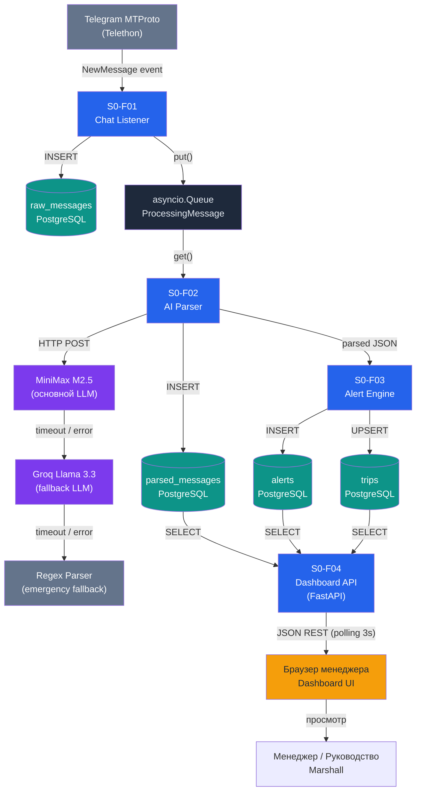
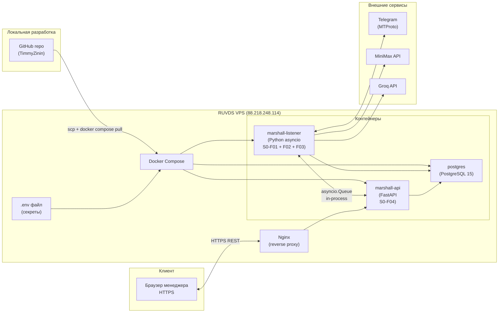

# Обзор архитектуры

Marshall AI Listener — Sprint 0 — Спринт 6: Интеграционный ревью


Marshall AI Listener — это четыре автономных модуля в едином asyncio-процессе.

Данные текут в одном направлении: Telegram → Listener → Parser → Alert Engine → Dashboard API.

Ни один модуль не знает о деталях другого — только о контракте данных на границе.


## 1. Системная диаграмма





## 2. Описание модулей


 
S0-F01
 

### Chat Listener

 
- Telethon MTProto, pluggable-адаптер

- 3 группы + DM, только текст

- Rate limit: 30 msg/сек

- SQLite-буфер при превышении

- Graceful shutdown, авто-reconnect

- JSON-логирование в stdout

 
 
 
S0-F02
 

### AI Parser

 
- 9 извлекаемых полей + confidence

- MiniMax M2.5 → Groq → Regex

- Дедупликация: 5-мин окно

- Версионирование промпта

- Rate limit: 100 запросов/мин LLM

- Budget: ≤50K токенов/день

 
 
 
S0-F03
 

### Alert Engine

 
- 5 типов алертов

- 3 уровня severity: HIGH/MED/LOW

- Правила для 6 заказчиков (YAML)

- Дедупликация: 5 мин на рейс

- Статусы: new, reviewed, resolved

- Latency детекции: <100 мс

 
 
 
S0-F04
 

### Dashboard API

 
- FastAPI + asyncpg, только REST

- JWT, роли: admin / manager / viewer

- Polling каждые 3 секунды

- 9 групп эндпоинтов

- Пагинация, фильтрация, сортировка

- CORS для браузерного клиента

 
 


## 3. Карта потоков данных


Ниже показан путь одного сообщения от поступления из Telegram до появления алерта в дашборде.


```mermaid
sequenceDiagram
participant TG as Telegram
(MTProto)
participant CL as Chat Listener
participant PG1 as raw_messages
participant Q as asyncio.Queue
participant AP as AI Parser
participant LLM as MiniMax / Groq
participant PG2 as parsed_messages
participant AE as Alert Engine
participant PG3 as alerts / trips
participant API as Dashboard API
participant UI as Browser UI
```

TG->>CL: NewMessage event (text)
CL->>PG1: INSERT raw_message (<200ms)
CL->>Q: put(ProcessingMessage) (<50ms)
Q->>AP: get() — async consumer
AP->>LLM: POST /chat (prompt + context)
LLM-->>AP: JSON {trip_id, status, urgency, confidence}
AP->>PG2: INSERT parsed_message
AP->>AE: emit parsed_data (in-process call)
AE->>AE: evaluate rules (YAML config)
AE->>PG3: INSERT alert (if triggered)
AE->>PG3: UPSERT trips (aggregate)
UI->>API: GET /api/alerts?severity=high (polling 3s)
API->>PG3: SELECT alerts WHERE status=new
API-->>UI: JSON [{alert_id, trip_id, severity, message}]


## 4. Карта интерфейсов между модулями


 
 
 
 
 
 
 
 
 
 
 
 
**
 
 
 
 
 
 
 
**
 
 
 
``
 
 
 
**
 
 
``
``
 
 
 
**
 
 
 
 
 
 
 
**
 
 
 
``
 
 
 
**
 
 
 
``
 
 
 
**
 
 
 
````
 
 
 
**
 
 
 
``````
 
 
 
**
 
 
 
 
 
 
 

| Граница | От | К | Механизм | Формат | Гарантия |
| --- | --- | --- | --- | --- | --- |
| IF-01 | Telegram | Chat Listener | MTProto (Telethon event) | TL объект Message | At-most-once (Telegram) |
| IF-02 | Chat Listener | PostgreSQL | asyncpg INSERT | SQL строка raw_messages | At-least-once (retry x3) |
| IF-03 | Chat Listener | AI Parser | asyncio.Queue (in-process) | ProcessingMessage dataclass | At-least-once (SQLite buffer) |
| IF-04 | AI Parser | MiniMax / Groq | HTTPS POST (httpx async) | JSON prompt → JSON response | Timeout 5s, fallback chain |
| IF-05 | AI Parser | PostgreSQL | asyncpg INSERT | SQL строка parsed_messages | At-least-once (retry x3) |
| IF-06 | AI Parser | Alert Engine | In-process function call | ParsedData dataclass / dict | Synchronous, no loss |
| IF-07 | Alert Engine | PostgreSQL | asyncpg INSERT + UPSERT | SQL строки alerts, trips | At-least-once (retry x3) |
| IF-08 | Dashboard API | PostgreSQL | asyncpg SELECT | SQL trips, alerts, parsed_messages | Read-only, connection pool |
| IF-09 | Browser UI | Dashboard API | HTTP REST + JWT Bearer | JSON (Pydantic v2 схемы) | Polling каждые 3 сек |


## 5. Контракты данных на границах


### IF-03: Chat Listener → AI Parser (ProcessingMessage)

@dataclass
class ProcessingMessage:
raw_message_id: int # FK → raw_messages.raw_message_id
chat_id: int # ID чата Telegram (-1001234567890)
text: str # Полный текст сообщения
sender_name: str # Имя/никнейм отправителя
timestamp: datetime # Время отправки (UTC)
is_direct_message: bool # True = DM, False = группа


### IF-06: AI Parser → Alert Engine (ParsedData)


# Выходной JSON AI Parser, передаётся в Alert Engine синхронно
{
"message_id": "msg_uuid_123", # UUID исходного сообщения
"trip_id": "4521", # Идентификатор рейса (str | null)
"route_from": "Москва", # Город отправления (str | null)
"route_to": "Краснодар", # Город назначения (str | null)
"slot_time": "14:00", # Время слота HH:MM (str | null)
"status": "assigned", # assigned|loading|in_transit|
# unloading|completed|problem
"customer": "WB", # Тандер|WB|X5|Магнит|Сельта|Сибур|other|null
"urgency": "low", # low|medium|high
"issue": null, # Описание проблемы ≤150 символов | null
"confidence": 0.95, # 0.0–1.0
"llm_provider": "minimax", # minimax|groq|regex
"prompt_version": "v1" # версия промпта
}


### IF-09: Dashboard API → Browser UI (Alert Response)


# GET /api/alerts — элемент массива
{
"alert_id": 42,
"trip_id": "4521",
"alert_type": "delay", # delay|equipment_failure|downtime|
# safety_violation|docs_missing
"severity": "high", # high|medium|low
"message": "Опоздание на слот WB ~40 мин. Рейс 4521.",
"customer": "WB",
"status": "new", # new|reviewed|resolved
"created_at": "2026-03-06T14:32:10Z",
"reviewed_by": null,
"resolved_at": null
}


## 6. Схема базы данных: обзор связей


erDiagram
raw_messages {
BIGSERIAL raw_message_id PK
BIGINT chat_id
BIGINT message_id
BIGINT sender_id
VARCHAR sender_name
TEXT text
TIMESTAMPTZ timestamp
TIMESTAMPTZ created_at
BOOLEAN is_direct_message
JSONB raw_data_json
}
parsed_messages {
BIGSERIAL id PK
UUID message_id UK
BIGINT chat_id FK
BIGINT raw_message_id FK
VARCHAR trip_id
VARCHAR route_from
VARCHAR route_to
TIME slot_time
VARCHAR status
VARCHAR customer
VARCHAR urgency
TEXT issue
DECIMAL confidence
VARCHAR llm_provider
VARCHAR prompt_version
BOOLEAN needs_review
}
alerts {
BIGSERIAL alert_id PK
VARCHAR trip_id FK
VARCHAR alert_type
VARCHAR severity
TEXT message
VARCHAR customer
VARCHAR status
TIMESTAMPTZ created_at
VARCHAR reviewed_by
TIMESTAMPTZ resolved_at
}
trips {
VARCHAR trip_id PK
VARCHAR route_from
VARCHAR route_to
VARCHAR customer
VARCHAR status
VARCHAR urgency
TEXT last_issue
TIMESTAMPTZ first_seen_at
TIMESTAMPTZ last_updated_at
INTEGER alert_count
INTEGER message_count
}
dashboard_users {
BIGSERIAL user_id PK
VARCHAR username UK
VARCHAR role
TIMESTAMPTZ created_at
TIMESTAMPTZ last_login_at
}

raw_messages ||--o{ parsed_messages : "raw_message_id"
parsed_messages ||--o{ alerts : "trip_id"
parsed_messages ||--o| trips : "trip_id (UPSERT)"


## 7. Технологический стек


 
 

### Backend (единый сервис)

 
 
 
``
``
``
 
 
 
``
``
``
``
 
 
| Компонент | Технология |
| --- | --- |
| Язык | Python 3.11+ |
| Асинхронность | asyncio (нативный) |
| Telegram transport | Telethon 1.34 (MTProto) |
| LLM (основной) | MiniMax M2.5 API |
| LLM (fallback) | Groq Llama 3.3 70B |
| LLM (аварийный) | Regex-парсинг |
| HTTP клиент | httpx async |
| Валидация | pydantic v2 |
| Конфиг | python-dotenv |
| Логирование | python-json-logger |


 
 
 

### API + Инфраструктура

 
 
 
``
``
``
``
 
``
 
 
 
````
 
 
| Компонент | Технология |
| --- | --- |
| API фреймворк | FastAPI |
| DB драйвер | asyncpg |
| База данных | PostgreSQL 15+ |
| Rate limit буфер | aiosqlite (SQLite) |
| Авторизация | JWT (HS256, 24h TTL) |
| Контейнеризация | Docker + Compose |
| Хостинг | RUVDS VPS (88.218.248.114) |
| Фронтенд | HTML + vanilla JS + Chart.js |
| Правила алертов | YAML (конфиг-файл) |
| Тесты | pytest + pytest-asyncio |


 


## 8. Архитектурные решения (ADR)


 
ADR-001
Единый asyncio-процесс вместо микросервисов
Принято
 
 
Контекст
Sprint 0 — бесплатный пилот с жёстким ограничением по времени. Нужно максимально быстро доставить рабочую демонстрацию Николе Боброву (Marshall). Любой overhead на коммуникацию между сервисами замедляет разработку и увеличивает задержку.


 
 
Решение
Все 4 модуля (Chat Listener, AI Parser, Alert Engine, Dashboard API) работают в одном Python-процессе под управлением `asyncio`. Взаимодействие — через `asyncio.Queue` и прямые function calls. Единый контейнер Docker.


 
 
Последствия
 
**- + Нет сетевого overhead между модулями — latency минимальная

**- + Один Dockerfile, простой деплой на RUVDS

**- + Единый structured log stream в stdout

**- + Отладка проще — один процесс, один трейс

**- - При падении одного модуля падает весь процесс (митигируется graceful shutdown)

**- - Масштабирование только вертикальное (Sprint 0 не требует горизонтального)

 
 
 
Альтернативы
RabbitMQ/Kafka + 4 отдельных сервиса — отклонено. Избыточная сложность для пилота. Kafka требует отдельного кластера, что противоречит ограничению "работает на одном VPS".


 


 
ADR-002
Telethon MTProto как единственный транспорт Sprint 0 (с Pluggable Adapter)
Принято
 
 
Контекст
Telegram планировал ограничения на работу в РФ с 1 апреля 2026. Кроме Telegram, Marshall использует Max, WhatsApp, Viber. Нужно решение, позволяющее быстро переключиться.


 
 
Решение
В Sprint 0 — только Telethon MTProto (строка `LISTENER_MODE=mtproto` в .env). Архитектура Chat Listener строится вокруг абстракции `TransportAdapter` с методами `connect()`, `listen()`, `disconnect()`. Реализована только `TelethonAdapter`. `BotAPIAdapter`, `MaxAdapter` — заглушки для Sprint 1.


 
 
Последствия
 
**- + Переключение на другой мессенджер за <7 дней (только новый Adapter)

**- + Основная бизнес-логика не зависит от транспорта

**- - Риск бана сервисного Telegram-аккаунта (митигируется отдельным номером телефона)

 
 
 
Риск
HIGH Блокировка Telegram в РФ. Митигация: `MaxAdapter` готов за <7 дней после решения.


 


 
ADR-003
Fallback chain: MiniMax M2.5 → Groq Llama 3.3 → Regex
Принято
 
 
Контекст
Система должна работать 99%+ времени. Зависимость от одного LLM-провайдера создаёт единую точку отказа. MiniMax имеет дневной бюджет токенов, Groq — бесплатный tier с ограничением.


 
 
Решение
 
- Попытка 1: MiniMax M2.5, timeout 5 сек

- Попытка 2: Groq Llama 3.3 70B, timeout 5 сек (при ошибке/timeout MiniMax)

- Попытка 3: Regex-парсинг (базовое распознавание trip_id, urgency)

- Penalty confidence: -0.25 при fallback на Groq, результат regex — confidence <0.50

 
 
 
Последствия
 
**- + Система продолжает работу при отказе любого одного LLM

**- + Groq бесплатный — экономия при превышении дневного бюджета MiniMax

**``- - Результаты Groq и regex могут отличаться по качеству (отслеживается через llm_provider в логах)

 
 


 
ADR-004
PostgreSQL для всех хранилищ, без ORM
Принято
 
 
Контекст
Нужна надёжная БД, поддерживающая JSONB, параллельные INSERT от нескольких asyncio task, и быстрые SELECT для дашборда. SQLite не подходит для параллельных операций.


 
 
Решение
Единая PostgreSQL 15+ инстанция. Все 5 таблиц (`raw_messages`, `parsed_messages`, `alerts`, `trips`, `dashboard_users`) в одной БД. Доступ через `asyncpg` напрямую (plain SQL), без SQLAlchemy/Alembic. Миграции — нумерованные plain SQL файлы (`001_init.sql`…). SQLite используется только как rate-limiting буфер Listener.


 
 
Последствия
 
**``- + JSONB для raw_data_json, высокая производительность SELECT с индексами

**- + Нет overhead ORM — прямой контроль SQL

**- + asyncpg — один из самых быстрых Python-драйверов PostgreSQL

**- - Нет автомиграций (управляется вручную, достаточно для Sprint 0)

 
 


 
ADR-005
Правила Alert Engine в YAML (не в БД)
Принято
 
 
Контекст
Alert Engine должен детектировать 5 типов событий по правилам для 6 заказчиков. Правила могут меняться в процессе демонстрации (итерация с командой Marshall). Хранение правил в БД потребует UI для управления ими — это Sprint 1+.


 
 
Решение
Правила хранятся в YAML-файле (`config/alert_rules.yaml`), загружаемом при старте. Изменение правил — редактирование файла + перезапуск контейнера. Структура: `customers[name].rules[type].conditions`.


 
 
Последствия
 
**- + Быстрая итерация правил без кода и UI

**- + Правила видны в git-истории (аудит изменений)

**- - Требует перезапуска при изменении (приемлемо для Sprint 0)

 
 


 
ADR-006
REST polling вместо WebSocket для дашборда
Принято
 
 
Контекст
Дашборд должен показывать актуальные данные. WebSocket потребует дополнительной логики поддержания соединения, обработки разрывов и аутентификации WS. В Sprint 0 нет мобильного клиента и нет требования к push.


 
 
Решение
Браузер делает polling GET-запросы каждые 3 секунды к `/api/alerts`, `/api/trips`, `/api/stats`. Аутентификация через JWT Bearer. WebSocket — Sprint 1+.


 
 
Последствия
 
**- + Простая реализация — стандартный fetch() в браузере

**- + Latency 0–3 сек (достаточно для задачи — не трейдинг)

**- - Дополнительная нагрузка на PostgreSQL от polling (20 запросов/мин на пользователя, минимально)

 
 


 
ADR-007
JWT авторизация с тремя ролями (без OAuth/SSO)
Принято
 
 
Контекст
Дашборд нужно защитить паролем. В Sprint 0 нет требования к интеграции с корпоративной аутентификацией Marshall (1С, АРМ). OAuth/LDAP — Sprint 1+.


 
 
Решение
JWT (HS256), срок жизни 24 часа, секрет в `.env`. Три роли: `admin` (полный доступ), `manager` (просмотр + управление алертами), `viewer` (только чтение). Пользователи в таблице `dashboard_users`. При старте — seed admin-пользователь из `.env`.


 
 
Последствия
 
**````- + Минимальная реализация — только python-jose + passlib

**- + Ролевой контроль из коробки через payload JWT

**- - Нет SSO, каждый пользователь создаётся вручную admin'ом (достаточно для 3–5 человек в Sprint 0)

 
 


 
ADR-008
Дедупликация сообщений и алертов: 5-минутное окно
Принято
 
 
Контекст
Диспетчеры часто повторяют одно и то же сообщение (или Telegram доставляет его дважды при нестабильной сети). AI Parser не должен дважды вызывать LLM на одно сообщение. Alert Engine не должен создавать дубли алертов на один рейс.


 
 
Решение
 
**``- AI Parser: dedup по hash(text + sender_id) с TTL=5 мин. Хранится в памяти (dict) или Redis при наличии.

**````- Alert Engine: dedup по (trip_id, alert_type) с TTL=5 мин. Проверка через SELECT по created_at > now() - interval '5 min'.

 
 
 
Последствия
 
**- + Экономия LLM-токенов (до 30% при высоком trафике повторных сообщений)

**- + Менеджер не захлёбывается дублирующимися алертами

**- - При перезапуске in-memory dedup сбрасывается (edge case, в пилоте некритично)

 
 


## 9. Разрешение противоречий между спецификациями


В ходе интеграционного ревью выявлены и разрешены следующие несоответствия между спецификациями модулей:


 
 
 
 
 
 
``
 
``
 
 
 
 
````
 
````
 
 
 
 
 
 
````
 
 
 
 
````
 
``````
 
 
 
 
``
 
``
 
 
 
 
``
 
``
 
 
 

| ID | Конфликт | Между | Решение | Статус |
| --- | --- | --- | --- | --- |
| CR-01 | Тип очереди: Chat Listener использует asyncio.Queue, AI Parser spec упоминает Redis/RabbitMQ | S0-F01 ↔ S0-F02 | Sprint 0: asyncio.Queue (единый процесс, ADR-001). Redis/RabbitMQ — опционально в Sprint 1 при горизонтальном масштабировании | Разрешено |
| CR-02 | Таблица parsed_messages: поле raw_message_id не описано в spec-data-schema, но требуется по spec AI Parser | S0-F02 ↔ data-schema | Добавить FK raw_message_id BIGINT REFERENCES raw_messages(raw_message_id) в parsed_messages. Схема данных — эталон | Разрешено |
| CR-03 | Alert Engine spec не указывает механизм получения данных от AI Parser (push vs pull) | S0-F02 ↔ S0-F03 | In-process synchronous call (ADR-001): после INSERT в parsed_messages AI Parser вызывает alert_engine.evaluate(parsed_data) напрямую | Разрешено |
| CR-04 | Alert status в spec Dashboard API: new/reviewed/resolved vs в spec Alert Engine: created/reviewed/resolved | S0-F03 ↔ S0-F04 | Эталонные значения: new, reviewed, resolved. Обновить CHECK constraint в схеме БД и Alert Engine spec | Разрешено |
| CR-05 | Дедупликация в AI Parser: spec говорит hash по (message_text, sender_id, timestamp), но timestamp меняется при ретрансляции | S0-F02 | Hash по (text, sender_id) без timestamp. TTL=5 мин обеспечивает временное окно | Разрешено |
| CR-06 | confidence фильтр Alert Engine: spec говорит <0.60 не алертировать, spec AI Parser говорит <0.50 = не логистика | S0-F02 ↔ S0-F03 | Alert Engine проверяет confidence >= 0.60 перед созданием алерта. AI Parser помечает confidence=0 при полном сбое — оба правила консистентны | Разрешено |


## 10. Нефункциональные требования системы


 
≤5 сек
End-to-end latency
(сообщение → алерт в UI)
 
 
≥99%
Uptime за 7 дней пилота
 
 
≥85%
Точность парсинга trip_id
(на 100 сообщениях)
 
 
≤50K
LLM токенов в сутки
 
 
30 msg/сек
Максимальный throughput
(с буферизацией)
 
 
<100 мс
Latency Alert Engine
(parsed → alert INSERT)
 
 
<200 мс
Latency Chat Listener
(event → raw_messages INSERT)
 
 
6/6
Покрытие заказчиков
правилами Alert Engine
 


## 11. Безопасность


 
 

### Угрозы и митигации

 
 
 
 
 
 
 
 
 
 
 
 
 
 
 
 
 
 
 
 
 
 
 
 
 
 
 
 
 
| Угроза | Митигация |
| --- | --- |
| Утечка TG StringSession | Только в .env, не в git, не в логах |
| SQL injection в Dashboard API | Параметризованные запросы asyncpg ($1, $2) |
| Несанкционированный доступ к API | JWT Bearer на всех endpoint кроме /health и /login |
| Бан Telegram аккаунта | Сервисный аккаунт (не личный), логирование всех операций |
| Превышение LLM бюджета | Мониторинг токенов, fallback на Groq/Regex |
| Утечка PD в логах (имена, номера) | Логируются только message_hash, trip_id, customer — не текст |


 
 
 

### Чеклист перед деплоем (SEC)

 
- ☐ Все API endpoints требуют JWT Bearer

- ☐ Все SQL-запросы параметризованы

````- ☐ .env в .gitignore

- ☐ Секреты не в логах (audit log)

``- ☐ pip-audit без CRITICAL зависимостей

- ☐ TG StringSession — отдельный сервисный аккаунт

- ☐ CORS настроен на конкретный origin (не *)

- ☐ Rate limiting на /api/auth/login (5 попыток / мин)

 
 


## 12. Схема деплоя





### Команды деплоя

 
```
`# Деплой на RUVDS
sshpass -p 'Ruvds2026' scp -o PubkeyAuthentication=no \
docker-compose.yml .env root@88.218.248.114:/opt/marshall-listener/

sshpass -p 'Ruvds2026' ssh -o PubkeyAuthentication=no root@88.218.248.114 \
'cd /opt/marshall-listener && docker compose pull && docker compose up -d && docker compose ps'


# Проверка логов после деплоя
docker compose logs -f marshall-listener --tail=50`
```


## 13. Карта файлов проекта


marshall-listener/
├── docker-compose.yml # Compose: listener + api + postgres
├── Dockerfile # Единый образ Python 3.11-slim
├── requirements.txt # telethon, asyncpg, fastapi, httpx, pydantic ...
├── .env.example # Шаблон переменных окружения
│
├── config/
│ └── alert_rules.yaml # Правила Alert Engine для 6 заказчиков
│
├── migrations/
│ ├── 001_init.sql # Создание 5 таблиц + индексы
│ └── 002_seed_data.sql # Тестовые данные (3 чата, admin user)
│
├── src/
│ ├── main.py # Точка входа: asyncio.gather(listener, api)
│ ├── config.py # Загрузка .env через pydantic Settings
│ │
│ ├── listener/ # S0-F01: Chat Listener
│ │ ├── __init__.py
│ │ ├── chat_listener.py # ChatListener, основная логика
│ │ ├── adapters/
│ │ │ ├── base.py # TransportAdapter ABC
│ │ │ ├── telethon_adapter.py
│ │ │ └── bot_api_adapter.py # Заглушка Sprint 1
│ │ └── rate_limiter.py # RateLimiter + SQLite буфер
│ │
│ ├── parser/ # S0-F02: AI Parser
│ │ ├── __init__.py
│ │ ├── ai_parser.py # AIParser, consumer loop
│ │ ├── llm/
│ │ │ ├── minimax_client.py # MiniMax M2.5 клиент
│ │ │ ├── groq_client.py # Groq Llama 3.3 клиент
│ │ │ └── regex_parser.py # Аварийный regex fallback
│ │ ├── prompts/
│ │ │ └── v1.py # Промпт v1 (полный шаблон)
│ │ └── dedup.py # Дедупликация по hash+TTL
│ │
│ ├── alert_engine/ # S0-F03: Alert Engine
│ │ ├── __init__.py
│ │ ├── alert_engine.py # AlertEngine.evaluate()
│ │ ├── rules_loader.py # Загрузка YAML правил
│ │ └── dedup.py # Дедупликация алертов 5 мин
│ │
│ ├── api/ # S0-F04: Dashboard REST API
│ │ ├── __init__.py
│ │ ├── app.py # FastAPI app, CORS, startup
│ │ ├── auth.py # JWT: login, verify, roles
│ │ ├── routers/
│ │ │ ├── trips.py # /api/trips
│ │ │ ├── alerts.py # /api/alerts
│ │ │ ├── stats.py # /api/stats
│ │ │ ├── chats.py # /api/chats
│ │ │ └── health.py # /api/health
│ │ └── schemas.py # Pydantic v2 схемы ответов
│ │
│ └── db/
│ ├── connection.py # asyncpg pool, get_connection()
│ └── queries/ # SQL queries по модулям
│
└── tests/
├── conftest.py # pytest fixtures
├── test_listener/ # Unit + integration тесты Listener
├── test_parser/ # Unit + integration тесты Parser
├── test_alert_engine/ # Unit тесты Alert Engine
├── test_api/ # API endpoint тесты
└── fixtures/
└── sample_messages.json # 100 тестовых сообщений


## 14. Критерии приёмки системы (Sprint 0)


 

### Архитектурные критерии

 
``- Все 4 модуля запускаются одной командой docker compose up без ошибок

- Сообщение из Telegram попадает в дашборд за ≤5 сек (P95)

- При отключении MiniMax система автоматически переключается на Groq (fallback логируется)

- При SIGTERM процесс завершается корректно за ≤5 сек (graceful shutdown всех модулей)

``- Смена транспорта с MTProto на другой требует только изменения LISTENER_MODE в .env

- Все 6 конфликтов (CR-01…CR-06) реализованы согласно принятым решениям

- Unit-тесты покрывают ≥80% кода каждого модуля

 


 

### Открытые риски (не блокирующие Sprint 0)

 
**``- Блокировка Telegram в РФ — MaxAdapter не реализован. Митигация: готов за <7 дней при наступлении риска

**- Масштабирование >30 чатов — SQLite-буфер не тестировался при >300 сообщений/сек. Митигация: перейти на Redis в Sprint 1

**- In-memory dedup сбрасывается при перезапуске — возможны дублирующиеся алерты в первые 5 мин после перезапуска. Митигация: Redis dedup в Sprint 1

 


## 15. Глоссарий архитектурных терминов


 
 
 
 
**
**
**
**
**
**
**
**
**
**
**
**
 

| Термин | Определение |
| --- | --- |
| ADR | Architecture Decision Record — документ, фиксирующий архитектурное решение, контекст, альтернативы и последствия |
| asyncio | Стандартная Python-библиотека для асинхронного программирования. Основа единого процесса |
| asyncio.Queue | Потокобезопасная FIFO-очередь для передачи данных между coroutine в одном процессе |
| Pluggable Adapter | Паттерн проектирования: абстракция TransportAdapter позволяет подменить Telethon на BotAPI или Max без изменения основной логики |
| Fallback chain | Цепочка провайдеров: при недоступности основного автоматически используется следующий |
| Deduplication window | Временной интервал (5 мин), в котором повторная обработка идентичного события блокируется |
| Confidence score | Число 0.0–1.0, отражающее уверенность LLM в качестве парсинга. Используется Alert Engine как фильтр (<0.60 = не алертировать) |
| Severity | Критичность алерта: HIGH (штраф/срыв), MEDIUM (требует внимания), LOW (информационный) |
| Graceful shutdown | Корректное завершение процесса: дождаться окончания активных задач, закрыть соединения, освободить ресурсы |
| Polling | Периодический опрос API клиентом (каждые 3 сек). Альтернатива WebSocket для Sprint 0 |
| MTProto | Собственный протокол Telegram для клиентских подключений. Используется Telethon |
| asyncpg | Высокопроизводительный асинхронный PostgreSQL-драйвер для Python |